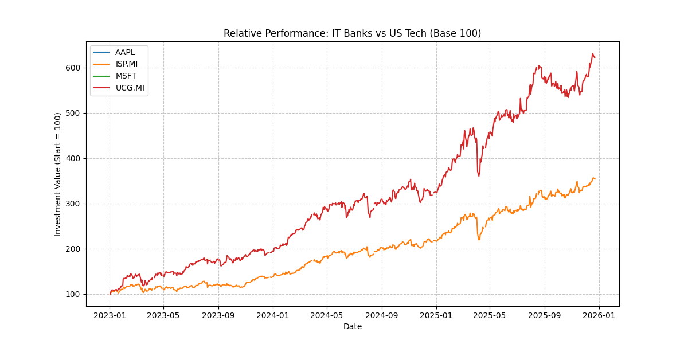

# Financial Market Analysis Tool

A Python-based tool to automate the comparison of financial assets using historical data. This script normalizes stock prices to a "Base 100" scale, allowing for a direct performance comparison between assets with vastly different price ranges.

(Example output: Comparative analysis of Italian Banks vs US Tech Giants)

## Key Features
* Automated Data Retrieval: Fetches real-time/historical data using the Yahoo Finance API (yfinance).
* Data Cleaning: Automatically aligns time-series data from different stock exchanges (e.g., Milan vs NASDAQ) by filtering out non-overlapping trading days to ensure accurate correlation.
* Data Normalization: Re-bases all assets to start at 100, enabling relative performance analysis.
* Visualization: Generates professional comparative charts using Matplotlib.

## Financial Logic: Base 100 Normalization
Comparing raw stock prices is misleading due to different denominations. This tool applies the following transformation to every data point:

P_normalized(t) = ( P_t / P_0 ) * 100

Where:
* P_t is the price at time t.
* P_0 is the initial price.

## Technologies Used
* Python 3.10+
* Pandas (Data manipulation)
* Yfinance (Market data)
* Matplotlib (Visualization)

## How to Run
1. Install the required libraries:
    pip install yfinance matplotlib pandas

2. Run the script:
    python stock_analysis.py

3. The chart will be displayed and saved locally as stock_performance.png.

---
Created by Notmvrc
